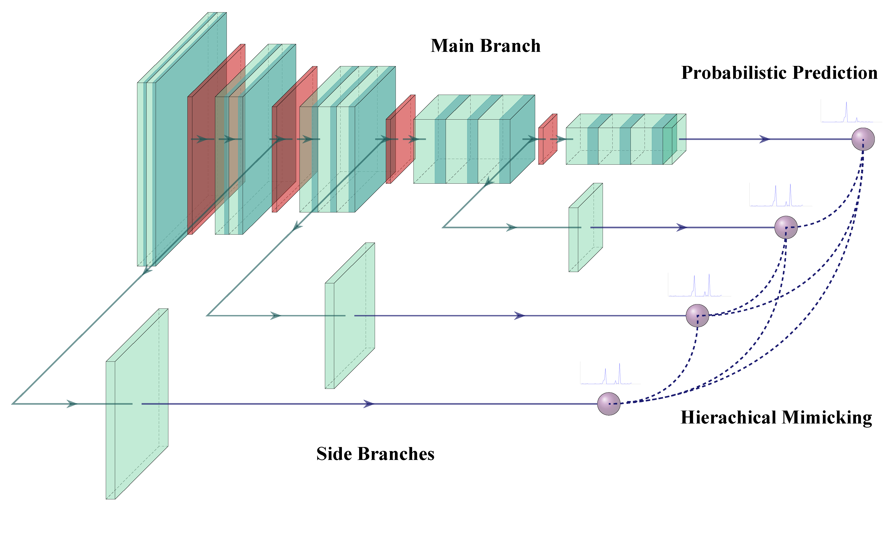

# Dynamic Hierarchical Mimicking

Official implementation of our DHM training mechanism as described in [Dynamic Hierarchical Mimicking Towards Consistent Optimization Objectives](https://arxiv.org/abs/2003.10739) (CVPR'20) by [Duo Li](https://github.com/d-li14) and [Qifeng Chen](https://github.com/CQFIO) on CIFAR-100 and ILSVRC2012 benchmarks with the [PyTorch](https://pytorch.org/) framework.

<p align="center"></p>

We dissolve the inherent defficiency inside the deeply supervised learning mechanism by introducing mimicking losses between the main branch and auxiliary branches located in different network depths, while no computatonal overheads are introduced after discarding those auxiliary branches during inference.

# Requirements
## Dependencies
* PyTorch 1.0+
* [NVIDIA-DALI](https://github.com/NVIDIA/DALI) (in development, not recommended)
## Dataset
Download the ImageNet dataset and move validation images to labeled subfolders.
To do this, you can use the following script: https://raw.githubusercontent.com/soumith/imagenetloader.torch/master/valprep.sh

# ImageNet Pretrained models
<table>
	<tr>
		<td>Architecture</td>
		<td>Method</td>
    <td>Top-1 / Top-5 Error (%)</td>
	</tr>
	<tr>
		<td rowspan="2">ResNet-18</td>
		<td><a href="https://hkustconnect-my.sharepoint.com/:u:/g/personal/dlibh_connect_ust_hk/EU9NEieZBB1Ktb9T8MobZ-ABKUjTaGv_lnG6b-geC3O7LA?e=eEfAb1">DSL</a></td>
		<td>29.728 / 10.450</td>
	</tr>
	<tr>
		<td><a href="https://hkustconnect-my.sharepoint.com/:u:/g/personal/dlibh_connect_ust_hk/Eaxq7mz5GMlJqEFQotYCvVQBBtoEJ06UIqHM6siY8VrfFA?e=N8Jebp">DHM</a></td>
		<td><b>28.714 / 9.940</b></td>
	</tr>
	<tr>
		<td rowspan="2">ResNet-50</td>
		<td><a href="https://hkustconnect-my.sharepoint.com/:u:/g/personal/dlibh_connect_ust_hk/EXP_tRBeaCFMiHczUS2Kf84Bco97hDPGTv6jkl9Wb-Answ?e=hJnd3E">DSL</a></td>
		<td>23.874 / 7.074</td>
	</tr>
	<tr>
		<td><a href="https://hkustconnect-my.sharepoint.com/:u:/g/personal/dlibh_connect_ust_hk/EZnzStUddRpKhS7fGxZ3EJkBibquoIgJaqGlq4PVTtug7Q?e=kfZsGG">DHM</a></td>
		<td><b>23.430 / 6.764</b></td>
	</tr>
	<tr>
		<td rowspan="2">ResNet-101</td>
		<td><a href="https://hkustconnect-my.sharepoint.com/:u:/g/personal/dlibh_connect_ust_hk/EfSsOTCWhVhFiM_GmnBc85EBlmJiy4x9SFEj_K411c5_DA?e=IEz4hq">DSL</a></td>
		<td>22.260 / 6.128</td>
	</tr>
	<tr>
		<td><a href="https://hkustconnect-my.sharepoint.com/:u:/g/personal/dlibh_connect_ust_hk/Ed3hCtX0EW5Dtq5SCwQbnIgBF8Saqsksjw7IPDecRUJAVQ?e=xr4Cim">DHM</a></td>
		<td><b>21.348 / 5.684</b></td>
	</tr>
	<tr>
		<td rowspan="2">ResNet-152</td>
		<td><a href="https://hkustconnect-my.sharepoint.com/:u:/g/personal/dlibh_connect_ust_hk/EY93Q0ToqlJEntNwRgHu_2sB_1Ld6YjBu1LHIO6Ye-CyOA?e=crwgcP">DSL</a></td>
		<td>21.602 / 5.824</td>
	</tr>
	<tr>
		<td><a href="https://hkustconnect-my.sharepoint.com/:u:/g/personal/dlibh_connect_ust_hk/EcyZgN3uW6FDmJinvVxwpYABg6SuvHZftctSdpK9024PKg?e=I3MHYM">DHM</a></td>
		<td><b>20.810 / 5.396</b></td>
	</tr>
</table>

\* *DSL* denotes **Deeply Supervised Learning**

\* *DHM* denotes **Dynamic Hierarchical Mimicking (ours)**

# Usage
## Training
Please refer to the [training recipes](https://github.com/d-li14/DHM/blob/master/TRAINING.md) for illustrative examples .

## Inference
After downloading the [pre-trained models](https://github.com/d-li14/DHM#imagenet-pretrained-models), you could test the model on the ImageNet validation set with this command line:
```shell
python imagenet.py \
    -a <resnet-model-name> \
    -d <path-to-ILSVRC2012-data> \
    --weight <pretrained-pth-file> \
    -e
```

# Citations
If you find our work useful in your research, please consider citing:
```
@InProceedings{Li_2020_CVPR,
author = {Li, Duo and Chen, Qifeng},
title = {Dynamic Hierarchical Mimicking Towards Consistent Optimization Objectives},
booktitle = {IEEE/CVF Conference on Computer Vision and Pattern Recognition (CVPR)},
month = {June},
year = {2020}
}
```
